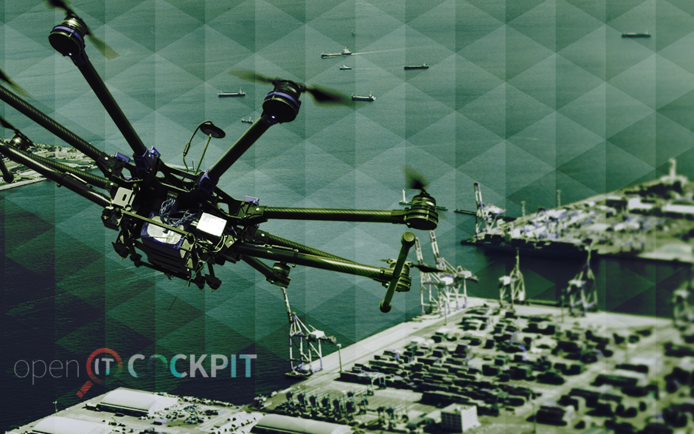

# OITC Copter

Simple wallpaper created for #Hacktoberfest2019 to contribute to issue https://github.com/it-novum/openITCOCKPIT/issues/960

The image was taken from a background image used on the website. The images were greated in Pixelmator Pro.

All images are 2880x1800 pixels (enough for video presentations while assisting with compression).

All designs are Public Domain (do what you want with it)

## View

1.  Perl

1.  Bad Tile

1.  Sun

1.  Blue

1.  Tri

1.  Green

1.  White

1.  Night